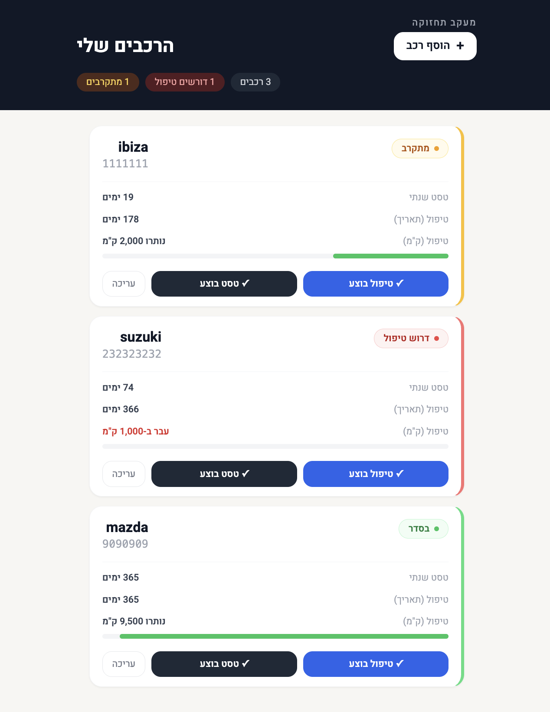

# CarMaintenance   🚗

A Hebrew RTL mobile-web app for tracking car maintenance — service intervals, annual tests (טסט), and email reminders. Built for Israeli car owners.

**Live:** https://carmaintenance-kkfz.onrender.com

---

## Screenshots

| כניסה | דשבורד |
|-------|--------|
|  |  |

---

## Features

- Enter your email to get your personal dashboard — no passwords, no sign-up
- Track multiple cars per dashboard
- Dual-trigger service alerts: by **date interval** or **KM**, whichever comes first
- Annual test (טסט) reminders
- Color-coded status: green (בסדר) / amber (מתקרב) / red (דרוש טיפול)
- KM progress bar per car
- Daily email alerts at 8:00 AM via [Resend](https://resend.com)
- Log service done / test done with one tap

---

## Tech Stack

| Layer | Tech |
|-------|------|
| Backend | Node.js + Express v5 + TypeScript |
| Database | PostgreSQL via [Prisma v5](https://www.prisma.io/) |
| Frontend | React + Vite + Tailwind CSS v3 |
| Email | [Resend](https://resend.com) |
| Hosting | [Render](https://render.com) (free tier) |
| DB hosting | [Neon](https://neon.tech) (serverless Postgres) |
| Tests | Vitest |

---

## Running Locally

### Prerequisites

- Node.js 18+
- PostgreSQL running locally

### Setup

```bash
git clone https://github.com/Am1its/CarMaintenance.git
cd CarMaintenance
npm install
```

Create a `.env` file:

```env
DATABASE_URL=postgresql://user@localhost:5432/carmaintenance
RESEND_API_KEY=re_your_key_here
ADMIN_SECRET=your_admin_secret
PORT=3000
APP_URL=http://localhost:3000
```

Run the database migration:

```bash
npx prisma migrate dev
```

Start development servers (two terminals):

```bash
# Terminal 1 — backend
npm run dev:server

# Terminal 2 — frontend
npm run dev:client
```

Open http://localhost:5173

### Build for production

```bash
npm run build
npm start
```

---

## Project Structure

```
├── src/
│   ├── index.ts              # Express app entry
│   ├── cron.ts               # Daily 8am notification job
│   ├── db.ts                 # Prisma singleton
│   ├── routes/
│   │   ├── dashboard.ts      # Email find-or-create, dashboard data
│   │   └── cars.ts           # CRUD + mark service/test done
│   └── services/
│       ├── calculations.ts   # Pure date/KM logic (UTC-safe)
│       ├── notifications.ts  # Alert rule engine
│       └── email.ts          # Resend integration
├── client/                   # React + Vite frontend (Hebrew RTL)
├── prisma/schema.prisma      # DB schema
└── tests/                    # Vitest unit tests
```

---

## Deployment

The app is deployed on Render (free tier) with a Neon PostgreSQL database.

Since Render free services sleep after inactivity, [cron-job.org](https://cron-job.org) pings the server at **07:55** every day to wake it before the 8:00 AM email cron fires.

Run migration on Neon:

```bash
DATABASE_URL=<neon_url> npx prisma migrate deploy
```
